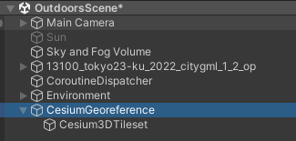
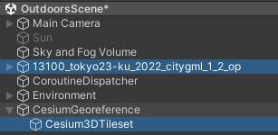
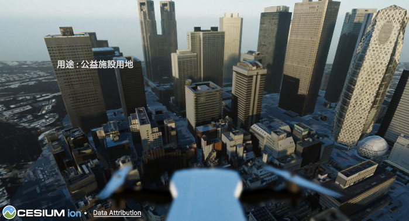

# 災害対策マルチプレイ　チュートリアル
     
## 目次
- [1. 都市風景ビューワー　チュートリアルの概要](#1-都市風景ビューワーチュートリアルの概要)
    - [1-1. チュートリアルの目的](#1-1-チュートリアルの目的)
    - [1-2. 開発環境](#1-2-開発環境)
    - [1-3. 準備](#1-3-準備)
- [2. 環境作成](#2-環境作成)
    - [2-1. プロジェクト作成](#2-1-プロジェクト作成)
    - [2-2. PLATEAU SDKの追加](#2-2-PLATEAU-SDKの追加)
    - [2-3. 3D都市モデルの読み込み](#2-3-3D都市モデルの読み込み)
    - [2-4. 視点移動機能の追加](#2-4-視点移動機能の追加)
    - [2-5. 初期カメラ位置の変更](#2-5-初期カメラ位置の変更)
    - [2-6. 景観機能の追加](#2-6-景観機能の追加)
    - [2-7. ドローンを追加する](#2-7-ドローンを追加する)
- [3. Cesium for Unityの読み込み](#3-Cesium-for-Unityの読み込み)
    - [3-1. Cesium for Unityの追加](#3-1-Cesium-for-Unityの追加)
    - [3-2. Cesium 3Dタイルの読み込み](#3-2-Cesium-3Dタイルの読み込み)
    - [3-3. 地形モデルにPLATEAU Terrain を設定する](#3-3-地形モデルにPLATEAU-Terrain-を設定する)
    - [3-4. 地形モデルにテクスチャを貼り付ける](#3-4-地形モデルにテクスチャを貼り付ける)
    - [3-5. Cesium for Unity上への3D都市モデルの配置](#3-5-Cesium-for-Unity上への3D都市モデルの配置)
- [4. 都市情報の表示](#4-都市情報の表示)
    - [4-1. テキストパネルの追加](#4-1-テキストパネルの追加)
    - [4-2. 都市情報取得機能の準備](#4-2-都市情報取得機能の準備)
    - [4-3. 都市情報取得機能の実装](#4-3-都市情報取得機能の実装)
    - [4-4. 選択された建物の色を変える](#4-4-選択された建物の色を変える)
- [5. 本チュートリアルの応用について](#5-本チュートリアルの応用について)

 
# 1. 災害対策マルチプレイ　チュートリアルの概要
## 1-1. チュートリアルの目的
PLATEAU の都市モデルを使ったユースケースでは、都市の様々なシミュレーション、まちづくりのための環境、ゲームなどが多く見られます。 <br>
こういったユースケースでは、PLATEAUや他の広域地図情報システムと連携しよりリアルな都市空間の再現が求められます。そしてシナリオの主題の中では、PLATEAUが持つ都市モデルと連携して各種の情報を取得し活用することが求められます。 <br>
このチュートリアルでは、PLATEAU SDK for Unity とPLATAEU SDK Toolkit を用いて以下のような処理を実装しています。 <br>
- PLATEAU SDK for Unityを使った都市モデルの読み込み
- PLATEAU SDK Toolkit for Unity の Render Toolkitを用いた空の描画
- 同じくSandbox Toolkitを用いたドローンモデルの表示
- Maps Toolkit を使ったCesium の広域マップの表示とPLATEAU都市モデルとの連携
- 都市モデルの選択抽出処理
- 選択された建物モデルが持つ都市モデルデータの取得と活用
以上の処理を実装することで、PLATEAUの持つ情報活用の基本的なパターンのアプリケーションの開発を学習することができます。 <br>

## 1-2. 開発環境
Unity Version 2021.3.35F1(LTS) 以降とVisual Studio <br>
PLATEAU SDK for Unity <br>
PLATEAU SDK toolkit for Unity <br>
- Rendering Toolkit ： 都市環境の再現
- Sandbox Tookit ：人や車、街路樹などのオブジェクトを配置し動かす
Maps Toolkit：Cesium for Unity との連携に使用 <br>
Cesium for Unity ：Maps Toolkit と併用して使用 <br>

## 1-3. 準備
Unityの開発環境を整えます。 <br>
PLATEAU SDK for Unity をダウンロードしておきます。（[2-2. PLATEAU SDKの追加](#2-2-PLATEAUSDKの追加)） <br>
PLATEAU SDK Toolkit for Unity をダウンロードしておきます。（[インストール方法](https://github.com/Project-PLATEAU/PLATEAU-SDK-Toolkits-for-Unity?tab=readme-ov-file#3-plateau-sdk-toolkits-for-unity-%E3%81%AE%E3%82%A4%E3%83%B3%E3%82%B9%E3%83%88%E3%83%BC%E3%83%AB)） <br>
Maps Toolkit をダウンロードしておきます。 <br>
Cesium for Unity をダウンロードしておきます。 <br>


# 2. 環境作成

## 2-1. プロジェクト作成
Unity Hub からプロジェクトを作成します。3D(HDRP) を選択してプロジェクトを作成します。 <br>


## 2-2. PLATEAU SDK追加
作成されたプロジェクトに、PLATEAU SDK for Unity を導入します。 <br>
https://project-plateau.github.io/PLATEAU-SDK-for-Unity/manual/Installation.html

## 2-3. 3D都市モデルの読み込み
Plateau SDK を使って3D都市モデルをインポートします。 <br>
https://project-plateau.github.io/PLATEAU-SDK-for-Unity/manual/ImportCityModels.html


## 2-4. 視点移動機能の追加
マウスの右クリック&ドラッグで視点方向を、キーボードのASDWQEキーで前後左右、そして上下方向の移動する機能を実装します。 <br>
Hierarchy パネルから MainCameraを選択します。Inspector パネルで、Add Conponet を押して、CameraController と入力し、そのまま NewScript を選択、続けてCreate and Add を選択してスクリプトを作成します。 <br>
 <br>

 
 Camera Controller が追加されたら、CameraController 名部分をダブルクリックしてコード作成に入ります。 <br>


 下のようにコードを実装します。 <br>
 
```C#
using System.Collections;
using System.Collections.Generic;
using UnityEngine;

public class CameraController : MonoBehaviour
{
    [SerializeField] float m_Sensitivity = 2.0f;
    float m_RotationX = 0.0f;
    float m_RotationY = 0.0f;

    // Start is called before the first frame update
    void Start()
    {
        m_RotationX = transform.eulerAngles.y;
        m_RotationY = transform.eulerAngles.x;
    }

    // Update is called once per frame
    void Update()
    {
        if (Input.GetMouseButton(1))
        {
            m_RotationX += Input.GetAxis("Mouse X") * m_Sensitivity;
            m_RotationY += Input.GetAxis("Mouse Y") * m_Sensitivity;
            m_RotationY = Mathf.Clamp(m_RotationY, 0f, 80f);
            transform.rotation = Quaternion.Euler(m_RotationY, m_RotationX, 0);
        }

    }
}
```

さらに、Update 関数の末尾に、以下のようなコードを追加すると、カーソルキーでの移動もできるようになります。（ASDW か カーソルキーで移動し、左Shift キーを押すと速く移動できる）

```C#
public class CameraController : MonoBehaviour
{
    [SerializeField] float m_Sensitivity = 2.0f;
    [SerializeField] float m_MoveSpeed = 100.0f;
    float m_RotationX = 0.0f;
    float m_RotationY = 0.0f;

    // 中略

    // Update is called once per frame
    void Update()
    {
　　　　　// 中略

        float horizontalInput = Input.GetAxis("Horizontal");
        float verticalInput = Input.GetAxis("Vertical");
        Vector3 movement =
            new Vector3(horizontalInput, 0f, verticalInput) * m_MoveSpeed * Time.deltaTime;

        transform.Translate(movement);

        if (Input.GetKey(KeyCode.Q))
            transform.Translate(Vector3.down * m_MoveSpeed * Time.deltaTime);
        if (Input.GetKey(KeyCode.E))
            transform.Translate(Vector3.up * m_MoveSpeed * Time.deltaTime);
    }
}
```


また、以下のスクリプトを追加することで、QEキーで上下移動をすることも出来ます。
```C#
    void Update()
    {
        // 中略

        if (Input.GetKey(KeyCode.Q))
            transform.Translate(Vector3.down * m_MoveSpeed * Time.deltaTime);
        if (Input.GetKey(KeyCode.E))
            transform.Translate(Vector3.up * m_MoveSpeed * Time.deltaTime);
    }
```


## 2-5. 初期カメラ位置の変更
また、Unity のScene View で見やすい場所に移動したら、Hierarchy から Main Camera を選択して、「Control（Command） + Shift + F」を押します。 <br>
こうすることで現在の位置をカメラの初期位置とすることが出来ます。 <br>


PLATEAU の読み込みが終わったら、アプリを実行します。（右クリック＆ドラッグで視点移動、ASDWキーで移動） <br>


## 2-6. 景観機能の追加
よりリアルな空の状態を再現するためにRendering Toolkit を導入します。 <br>
作成されたプロジェクトに、PLATEAU SDK Toolkit for Unity を導入します。サンプルも併せて導入します。 <br>
https://github.com/Project-PLATEAU/PLATEAU-SDK-Toolkits-for-Unity


Rendering Toolkit のパネルを表示します（PLATEAU - PLATEAU Toolkit - Rendering Toolkit） <br>


環境要素ボタンを押します。（モバイル用のパーティクルシステムに付いての確認は「はい」で対応）天気と時間をコントロールする環境システムが表示されます。


「Time of Day」のスライダーを操作して、時間変化を確認してみましょう。さらに、テスト 実行して「Snow」や「Rain」「Cloudy」のスライダーを操作して、天気が変わるか確認してみましょう。

## 2-7. ドローンを追加する
ドローンからの空撮のようなシーンを再現するためにドローンを表示します。 <br>
Sandbox Toolkit のパネルを表示します。（PLATEAU - PLATEAU Toolkit - Sandbox Toolkit ）<br>


パネル右下の「ビルトインアセットをインポート」をクリックして、アセットを読み込みます。 <br>
 <br>

 
Sandbox Toolkit を使って ドローンをカメラに配置します。一番右のアイコン「プロップ」を選択します。<br>


表示されるプロップの一覧からドローンをHierarchy の MainCameraの下にドラッグ＆ドロップして配置します。 <br>


そして、配置したドローン（Prop_Drone_01）をインスペクターのTransform – Position – X,Y,Zを(0,-0.5,0.5) のあたいに変更してカメラから見えるように配置します。テスト実行をすると、ドローンのブレードも回転していることがわかります。 <br>


# 3. Cesium for Unityの読み込み
Cesium for Unity より Cesium のデータを読み込み、PLATEAUと位置を合わせます。

## 3-1. Cesium for Unityの追加
Cesium  の地図データを読み込むために、Cesium for Unity をインストールします。 <br>
Cesium for Unity のインストール <br>
他のパッケージと同様に、Package Manager から Tgzファイルの読み込みでパッケージを追加します。 <br>


## 3-2. Cesium 3Dタイルの読み込み
早速3Dタイル形式のCesiumの地図データをシーンに読み込みます。 <br>
メニューからCesium – Cesium を選択して、Cesium パネルを開きます。 <br>


パネル内の Quick Add Basic Assets の下にある Blank 3D Tiles Tileset をクリックすると、Hierarchy に「CesiumGeoreference」オブジェクトが作成されます。 <br>
 <br>

このオブジェクトの下には、Cesium3DTileset オブジェクトが作成されていて、このオブジェクトを通じて地図データが読み込まれ表示されます。 <br>


## 3-3. 地形モデルにPLATEAU Terrain を設定する
今回は地形モデルとして、PLATEAU配信サービス（試験運用）が提供する地形モデル（PLATEAU Terrain）を利用します。Hierarchy から Cesium3DTileset を選択して、TileSet Source に From Cesium Ion チュートリアルの「2.1. アクセストークン及びアセットID」に記載されている値を入力します。 <br>
 <br>

ここで読み込む地図の緯度経度を設定します。いったん読み込んだPLATEAU都市モデルを選択して、緯度経度をコピーします。 <br>
 <br>

コピーした緯度経度の情報を、CesiumGeoreferenceのLatitude Longitude にセットします。 <br>
 <br>

PLATEAUの地形データが読み込まれます。 <br>
 <br>

## 3-4. 地形モデルにテクスチャを貼り付ける
Cesium for UnityのRaster Overlay機能を利用して、読み込んだ地形モデルにテクスチャを貼り付けます。 <br>
Raster Overlay機能はCesiumから提供される航空画像テクスチャを Cesium ion経由で使用します。 <br>
「Cesium3DTileset」オブジェクトを選択し、Inspectorから「Add Component」を押下し Cesium Ion Raster Overlayコンポーネントを追加します。 <br>
 <br>

ここから、Cesium Ion アカウントへ接続し、アクセストークンを取得します。 <br>
追加した Cesium Ion Raster Overlay コンポーネントの 「Troubleshoot Token」を押して、Cesium3D Tileset:Cesiumパネルを開きます。 <br>
 <br>
 <br>

開いたパネルから、「Open Cesium Ion On the Web」を押してCesium ionのWebサイトを開きます。予め作成したCesium Ionのアカウントでログインしてください。（アカウントがない場合は、画面一番下の Signup for an account からアカウントを作成してください。ログインに成功するとPermission 確認画面が現れた場合は、「Allow」を押して進めます。 <br>


追加した Cesium Ion Raster Overlay コンポーネントの ion Asset ID を 2 に変更します。 <br>


この状態で、決定しようとすると、下記のようなダイアログが表示され、access tokenが求められます。「Select or create a new project default token」を選択してください。 <br>


「Select Cesium ion Token」ダイアログが開くので、「Use an existing token」にチェックを入れ、プルダウンの「Default Token」を選択します。入力したら「Use as Project Default Token」ボタンを押下します。 <br>


処理が成功すると、Cesium3DTilesetの地形モデルにテクスチャが表示されるようになります。 <br>


## 3-5. Cesium for Unity上への3D都市モデルの配置
最後にPLATEAUの都市モデルをCesium for Unity上でのグローバル座標を付与して位置合わせをします。はじめに読み込んだ都市モデルのGameObjectをCesiumGeoreferenceの子ブジェクトになるように移動します。 <br>



移動したPLATEAUの3D都市モデルのオブジェクトを選択して、Add Componentを押してCesium Globe Anchorを追加します。 <br>
 <br>


位置合わせをします。初めにMap Toolkit パッケージを Package Manager からほかのパッケージ同様にtgzファイル（com.unity.plateautoolkit.maps-1.0.0.tgz）の選択をしてインストールします。 <br>
インストールが完了したら、PLATEAU – PLATEAU Toolkit – Maps Toolkit を選択して、Map Toolkit パネルを表示します。 <br>


Map Toolkit パネルのPLATEAUモデルに、PLATEAU の3D都市モデルをドラッグ＆ドロップをして設定します。 <br>


設置が完了したら、「PLATEAUモデルの位置を合わせる」をおすとPLATEAUの3D都市モデルとCESIUM のマップの位置が完全に一致します。 <br>


# 4. 都市情報の表示
では、最後にビルをクリックしたらその3Dモデルに含まれる情報を画面に表示する機能を追加しましょう。 <br>

## 4-1. テキストパネルの追加
まずは、取得した都市情報を表示するテキストボックスを設定します。GameObject – UI – Text MeshPro を選択してText パネルをCanvasに追加します。 <br>


Text MeshPro を使用するため、TMPImporter から2つのコンポーネントを追加します。 <br>


Hierarchy から追加されたText Mesh Pro を選択し、左上から100,-100 の場所に 400x50のサイズで表示するよう設定します。Pivot も 0.5,0.5 から 0,1 に変更します。 <br>


日本語を扱うために、日本語フォントを追加します。NotoSansJP.UnityPackageを実行してフォントをインストールします。 <br>


TextMesh Pro の初期設定をします。Font Asset でインストールしてNotoSansJP-Regular SDF_4096 を選択し、Font Sizeは15に設定します。テキストは「建物を選択してください」と変更します。 <br>


## 4-2. 都市情報取得機能の準備
建物を選択する都市情報を表示する機能を実装します。まずは GameObject  - CreateEmpty でGameObjectを作成します。CityInfoViewと名前を変更します。 <br>


作成した、CityInfoViewオブジェクトを選択し、Inspector で AddComponent を選択して、TouchMessage コンポーネントを新規作成します。（New Message を選択してから、Create and Add でコンポーネントを新規作成） <br>


作成したTouchMessageコンポーネントを右クリックして、EditScriptを選択します。Visual Studio など設定されたコードエディタでTouchMessage.csが開きます。 <br>


## 4-3. 都市情報取得機能の実装
マウスをクリックした位置の建物を検知し、それが PLATEAUの3D都市モデルのビルのオブジェクトだった場合は、そのビルの情報からビルの仕様用途の情報（landUseType）を取得して、画面に表示する機能を実装します。 <br>
初めに必要なネームスペースへの接続をUsingで設定します。また、最終的に情報を出力するText MeshPro オブジェクトをInspectorで設定できるように TextMeshPro のインスタンスをシリアライズします。 <br>

```C#
using System.Collections;
using System.Collections.Generic;
using UnityEngine;
using TMPro;
using PLATEAU.CityInfo;
using System.Linq;

public class TouchMessage : MonoBehaviour
{
    [SerializeField] private TMP_Text textmeshpro;
```

続けて、以下の処理をUpdate関数の中で実装します。
1. マウスクリックした位置にある3Dオブジェクトを抽出して
2. 初めにPLATEAUの3Dオブジェクトかどうかを判定し、
3. さらに、それがPLATEAU の建物のオブジェクトかどうか判断し
4. ビルの場合はその属性情報 uro:buildingDetailAttribute の情報を取得し、
5. その中から建物の利用用途の情報 uro:landUseTypeを取得し
6. TextMeshProに利用用途情報を表示

```C#
    void Update()
    {
        if (textmeshpro == null)
            return;

        if (Input.GetMouseButtonDown(0))
        {
            //1. マウスクリックしたところでヒットするオブジェクトを抽出
            Ray ray = Camera.main.ScreenPointToRay(Input.mousePosition);
            RaycastHit[] hitsFromOwnClick = Physics.RaycastAll(ray);

            //ヒットしたオブジェクトをひとつずつ確認
            foreach (RaycastHit hit in hitsFromOwnClick)
            {
                //2. PLATEAUの都市モデルのみを抽出
                PLATEAUCityObjectGroup cityObjectGroup =
                    hit.collider.gameObject.GetComponent<PLATEAUCityObjectGroup>();
                if (cityObjectGroup != null)
                {
                    //3. PLATEAUの都市モデルのビルのモデルのみを抽出
                    var firstPrimaryObj = cityObjectGroup.PrimaryCityObjects.FirstOrDefault();
                    if (firstPrimaryObj != null && 
                        firstPrimaryObj.CityObjectType == PLATEAU.CityGML.CityObjectType.COT_Building)
                    {
                        //4. PLATEAUビルの属性情報を抽出し
                        var attributesMap = firstPrimaryObj.AttributesMap;
                        if (attributesMap.TryGetValue("uro:buildingDetailAttribute", out var attribute))
                        {
                            //5．建物の利用用途の情報を取得し
                            if (attribute.AttributesMapValue.TryGetValue("uro:landUseType", out var address))
                            {
                                //6. 建物の都市情報
                                textmeshpro.text = "用途 : " + address.StringValue;
                            }
                            else
                                textmeshpro.text = "情報無し";
                            break;
                        }
                    }
                }
            }
        }
    }
```

一旦保存したらインスペクターで、追加したTextMeshPro オブジェクトを TouchMessage の TextMeshProの項目にセットします。 <br>


実行して、建物をクリックするとその利用用途の情報が画面に表示されます。 <br>


情報は表示されますが、どの建物を選択したかわかりにくいので、選択した建物の色が変化する処理を実装します。 <br>

## 4-4. 選択された建物の色を変える
どのビルが選択されたかわかりやすくするために、選択した建物の色を変化させる機能を実装します。 <br>
初めに選択されたときに色＝マテリアルを用意します。Asset – Create – Materials からAsset 内にマテリアルを作成し、SelectedMaterial と名付けます。 <br>


インスペクターから、Selected Material の設定を実施します。 <br>
Surface Options - Surface Type ：Transparent <br>
Surface Input – Base Map ：RGBA （0, 255, 0, 192）に設定（半透明グリーン） <br>


塗りつぶすには、建物のオブジェクトに対してマテリアルを上書きしてしまえばよいのですが、選択から外れた建物に対しては元のマテリアルに戻さないといけません。つまり、クリックした際には元のマテリアルの情報を保存しておいて、選択が外れたら保存しておいた元のマテリアルに戻さなければいません。 <br>
まずは情報を格納するための変数を準備します。 <br>
```C#
public class TouchMessage : MonoBehaviour
{

    [SerializeField] private TMP_Text textmeshpro;

    // 選択肢た時の塗りつぶしマテリアル
    [SerializeField] Material highlightMaterial;
    //オリジナルの建物のマテリアル郡
    List<Material> originalMaterial = new List<Material>();
    // 現在選択されている建物のレンダリングコンポーネント
    private Renderer objectRenderer;
    // この前に選択されていた建物のレンダリングコンポーネント
    private Renderer prepBuildingObject;

    // Update is called once per frame
    void Update()

```

色の塗り分けは建物を選択したところで処理します。 <br>
1. オリジナルのマテリアルを保存します。
1-1. 描画のためのRendererオブジェクトを取得し
1-2. Renderer オブジェクトを通じて、建物のマテリアルをすべて抽出し
1-3. マテリアルリストに格納・保存します
1-4. そして今選択しているオブジェクトを前回のオブジェクトとして保存
2. 現在選択中の建物を選択描画用のマテリアルで塗りつぶします。 <br>

```C#
    void Update()
    {
　　　　// 中略

            //ヒットしたオブジェクトをひとつずつ確認
            foreach (RaycastHit hit in hitsFromOwnClick)
            {
　　　　// 中略
                    //3. PLATEAUの都市モデルのビルのモデルのみを抽出
                    var firstPrimaryObj = cityObjectGroup.PrimaryCityObjects.FirstOrDefault();
                    if (firstPrimaryObj != null && 
                        firstPrimaryObj.CityObjectType == PLATEAU.CityGML.CityObjectType.COT_Building)
                    {
                        //選択した建物のマテリアルを保存し、
                        objectRenderer = hit.collider.gameObject.GetComponent<Renderer>();
                        if (objectRenderer.materials.Length > 1)
                        {
                            for (int i = 0; i < objectRenderer.materials.Length; i++)
                                originalMaterial.Add(objectRenderer.materials[i]);
                            prepBuildingObject = objectRenderer;
                        }
                        //選択した建物を緑のマテリアルで塗り替え
                        objectRenderer.material = highlightMaterial;

                        //4. PLATEAUビルの属性情報を抽出
 ```

最後に、オブジェクトをどこかクリックした場合の選択解除処理として、一旦保存してあったオブジェクトを復元し、完了したら一時保管しておいた情報を消去するスクリプトを追加します。 <br>


```C#
    void Update()
    {
　　　　// 中略
        if (Input.GetMouseButtonDown(0))
        {
            //前の選択オブジェクトを元のマテリアルに戻す
            if (prepBuildingObject != null)
            {
                prepBuildingObject.materials = originalMaterial.ToArray();
                originalMaterial.Clear();
                prepBuildingObject = null;
            }

            //1. マウスクリックしたところでヒットするオブジェクトを抽出
 ```


以上で実装は完了です。インスペクターで、TouchMessageコンポーネントのHighlight Material に、前に作ったSelectedMaterialのマテリアルを設定します。 <br>


実行し、建物を選択すると色が変わり、その建物の使用用途が表示されます。 <br>


ここでのポイントは建物1つずつに情報取得と選択描画の処理を実装するのではなく、CityInfoView の TouchMessage スクリプトで纏めて処理をしている点にあります。 <br>

# 5. 本チュートリアルの応用について
広域マップの表示や、建物を選択しての都市情報を利用することができるようになりました。公開されているCity Rescue サンプルアプリケーションでは、オンライン上に部屋を立てて同じ空間を複数の人で共有できるメタバース的な機能を実装しています。この機能は Unity gaming Services に含まれるマルチプレイヤーの機能を使用して実装されています。実装を行いたい方はぜひドキュメントやサンプルプロジェクトを確認してみてください。 <br>

https://unity.com/solutions/multiplayer
